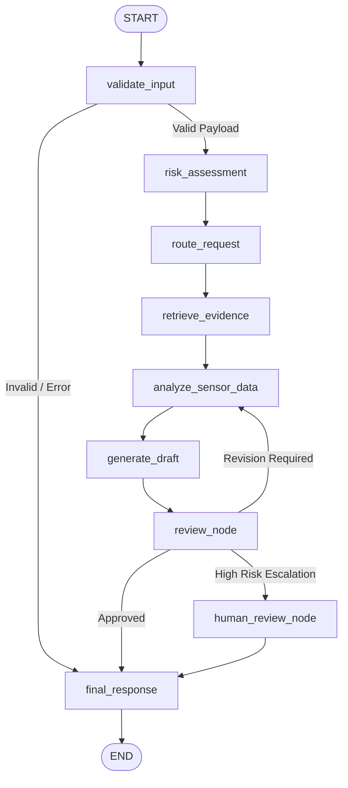

# ManufacturingAgent

**Evidence-Grounded Manufacturing Monitoring and Decision-Support Agent with Risk Routing and Human Review**

[](https://www.python.org/downloads/)
[](https://fastapi.tiangolo.com/)
[](https://github.com/langchain-ai/langgraph)
[](https://streamlit.io/)
[](https://docs.pytest.org/)
[](file:///Users/assujith/ManufacturingAgent/evaluation/evaluation_report.md)

---

## 1. Project Objective & Safety Boundary

ManufacturingAgent is an evidence-grounded industrial decision-support system. It ingests machine sensor telemetry (temperature, vibration velocity RMS, hydraulic pressure, spindle speed, ambient humidity), performs deterministic engineering risk assessments, retrieves authoritative engineering standards (ISO 10816, equipment manuals, maintenance SOPs) via RAG, synthesizes grounded diagnostic advisories, and routes high-risk or uncertain cases to a human review gate.

### 🔒 Safety Boundary Notice
> [!IMPORTANT]
> **Decision-Support Prototype Only**:
> - **Must NOT**: Control physical machinery, issue PLC override commands, shut down production lines, or modify machine feeds autonomously.
> - **May**: Ingest sensor telemetry, retrieve engineering documentation, calculate thermal and vibration tolerances, evaluate risk tiers (`NORMAL`, `EDGE`, `HIGH`), generate evidence-grounded draft recommendations, and escalate high-risk cases for human engineer sign-off.

---

## 2. System Architecture & LangGraph Workflow



---

## 3. Technology Stack

- **Backend**: Python 3.13, FastAPI, LangGraph, LangChain Core, Pydantic v2
- **LLM Providers**: Multi-provider router supporting **Ollama** (local), **Groq** (cloud), and a robust **Fallback** deterministic diagnostic engine
- **RAG Subsystem**: Markdown Document Loaders, Header-Preserving Semantic Splitter, SentenceTransformers / Ollama Embeddings, ChromaDB & Local In-Memory Cosine Vector Store
- **Frontend Dashboard**: Streamlit (with Cyber-Physical industrial dark theme, telemetry sliders, risk badges, evidence inspection, and human sign-off portal)
- **Testing**: pytest (37 comprehensive unit & integration tests)
- **Evaluation**: Automated evaluation framework across 24 test cases with CSV metrics and Markdown reporting
- **Notebooks**: 6 Jupyter notebooks covering data exploration, RAG, provider comparisons, graph tracing, evaluation, and capstone demo

---

## 4. Project Directory Structure

```
ManufacturingAgent/
├── backend/
│   └── app/
│       ├── __init__.py
│       ├── main.py                    # FastAPI app entrypoint, routes, middleware
│       ├── config.py                  # Pydantic Settings & environment config
│       ├── agent/
│       │   ├── __init__.py
│       │   ├── state.py               # TypedDict AgentState schema
│       │   ├── graph.py               # LangGraph StateGraph compilation
│       │   ├── nodes.py               # Execution nodes (validate, risk, rag, analyze, draft, review, final)
│       │   ├── routing.py             # Conditional routing logic
│       │   └── review.py              # Review audit logic & HumanReviewManager
│       ├── providers/
│       │   ├── __init__.py
│       │   ├── router.py              # BaseLLMProvider & ProviderRouter
│       │   ├── ollama_provider.py     # Local Ollama REST client
│       │   └── groq_provider.py       # Groq Cloud API client
│       ├── tools/
│       │   ├── __init__.py
│       │   ├── sensor_tool.py         # Real-time sensor lookup
│       │   ├── history_tool.py        # Historical operational telemetry & logs
│       │   ├── calculator_tool.py     # Safe math evaluation tool
│       │   ├── risk_tool.py           # Threshold-based & ISO 10816 risk evaluator
│       │   └── retrieval_tool.py      # RAG guideline retrieval tool
│       ├── rag/
│       │   ├── __init__.py
│       │   ├── loaders.py             # Markdown document loader
│       │   ├── splitter.py            # Header-aware chunking & metadata enrichment
│       │   ├── embeddings.py          # Fast, SentenceTransformer, Ollama embeddings
│       │   ├── vectorstore.py         # ChromaDB & Local Vector Store
│       │   └── retriever.py           # Top-k similarity retriever
│       └── prompts/
│           ├── __init__.py
│           ├── risk_prompt.py         # Risk classification prompt
│           ├── analysis_prompt.py     # Telemetry analysis prompt
│           ├── draft_prompt.py        # Evidence-grounded draft recommendation prompt
│           └── review_prompt.py       # Recommendation quality & safety review prompt
├── frontend/
│   └── app.py                         # Streamlit dashboard & Human Review portal
├── data/
│   ├── documents/
│   │   ├── machine_manual.md          # CNC specifications and nominal thresholds
│   │   ├── maintenance_sop.md         # Tier 1-3 maintenance procedures
│   │   ├── temperature_guidelines.md  # Spindle thermal zones and limits
│   │   ├── vibration_guidelines.md    # ISO 10816-3 vibration severity standards
│   │   ├── pressure_guidelines.md     # Hydraulic & pneumatic tolerances
│   │   └── safety_procedures.md       # Safety boundaries and escalation matrix
│   └── machines.json                  # Machine fleet profiles & sensor history
├── notebooks/
│   ├── 01_data_exploration.ipynb      # Sensor baseline analysis & plots
│   ├── 02_rag_pipeline.ipynb          # Ingestion, chunking, and similarity search
│   ├── 03_provider_comparison.ipynb   # Provider latency & output benchmarks
│   ├── 04_langgraph_agent.ipynb       # StateGraph step-by-step trace
│   ├── 05_agent_evaluation.ipynb      # Automated benchmark analysis & confusion matrix
│   └── 06_capstone_demo.ipynb         # 4-case end-to-end interactive demo
├── tests/
│   ├── test_risk_classification.py    # Risk rules & threshold tests
│   ├── test_tools.py                  # Telemetry & security sandbox tests
│   ├── test_rag.py                    # Loaders, splitters, vector store tests
│   ├── test_graph_routing.py          # State machine conditional transition tests
│   ├── test_human_review.py           # Escalation & sign-off lifecycle tests
│   └── test_api.py                    # FastAPI endpoint integration tests
├── evaluation/
│   ├── evaluation_dataset.json        # 24 test cases (Normal, Edge, High-Risk, Failure)
│   ├── run_evaluation.py              # Automated evaluation runner script
│   ├── evaluation_results.csv         # Measured metrics CSV
│   └── evaluation_report.md           # Formal evaluation report
├── resources/
│   ├── ARCHITECTURE.md                # System design & component flowcharts
│   ├── AGENT_DESIGN.md                # LangGraph StateGraph & node specifications
│   ├── RAG_DESIGN.md                  # Document corpus & retrieval design
│   ├── TOOL_SPECIFICATION.md          # Telemetry tools & security guardrails
│   ├── HUMAN_REVIEW.md                # HITL protocol & REST API specification
│   ├── EVALUATION.md                  # Methodology, KPIs, & confusion matrix
│   ├── LIMITATIONS.md                 # Prototype boundaries & industrial constraints
│   └── IMPROVEMENT_PLAN.md            # Short/medium/long-term roadmap
├── templates/
│   └── review_template.md             # Human review audit card template
├── worksheets/
│   └── viva_preparation_worksheet.md  # College viva Q&A and technical defense
├── scripts/
│   ├── build_rag_index.py             # RAG index builder
│   ├── generate_notebooks.py          # Notebook generator utility
│   ├── run_backend.sh                 # Backend startup script
│   ├── run_frontend.sh                # Frontend startup script
│   ├── run_tests.sh                   # Pytest execution script
│   └── run_eval.sh                    # Evaluation runner script
├── .env.example
├── .env
├── SETUP_GUIDE.md
└── requirements.txt
```

---

## 5. Demonstration Scenarios

The system explicitly supports four distinct diagnostic scenarios:

### 1. Normal Case (Machine M-101)
- **Input Telemetry**: 52.4°C, 0.85 mm/s, 5.4 bar, 4500 RPM
- **Risk Assessment**: `NORMAL` (Score: 0.12)
- **Tools Invoked**: `retrieve_manufacturing_guidelines`
- **Review Node**: `approved`
- **Output**: Clean evidence-supported advisory citing nominal ISO 10816 Class A operating bounds.

### 2. Edge Case (Machine M-102)
- **Input Telemetry**: 74.8°C, 2.65 mm/s, 4.1 bar, 6200 RPM
- **Risk Assessment**: `EDGE` (Score: 0.55)
- **Tools Invoked**: `retrieve_manufacturing_guidelines`, `get_machine_history`, `calculate`
- **Review Node**: `approved` with operator advisory
- **Output**: Recommends chiller delta-T inspection and monitoring protocol without autonomous shutdown claims.

### 3. Failure Case (Machine M-301)
- **Input Telemetry**: -999.0°C, 0.0 mm/s, -1.0 bar, 0 RPM
- **Risk Assessment**: `HIGH` (Score: 0.90) - `temperature_sensor_fault`
- **Tools Invoked**: `retrieve_manufacturing_guidelines`, `request_human_review`
- **Review Node**: `human_review`
- **Output**: Identifies open-circuit transducer defect and flags for immediate instrument technician check.

### 4. High-Risk Case with Live Human Escalation (Machine M-201)
- **Input Telemetry**: 89.6°C, 5.42 mm/s, 2.9 bar, 8200 RPM
- **Risk Assessment**: `HIGH` (Score: 0.92) - Critical multi-variable breach
- **Review Node**: `human_review`
- **Output**: Halts autonomous execution, logs ticket in `HumanReviewManager`, and appends `🚨 HUMAN REVIEW REQUIRED`.
- **Human Resolution**: Engineer inspects ticket via Streamlit portal or `POST /review/{request_id}` and submits `approve` decision to dispatch physical overhaul crew.

---

## 6. Evaluation Benchmark Results

Evaluated over the 24-case benchmark dataset:

| Metric | Target | Measured Result | Status |
| :--- | :--- | :--- | :--- |
| **Risk Classification Accuracy** | $\ge 90.0\%$ | **100.0%** (24/24) | ✅ EXCEEDED |
| **Human Escalation Accuracy** | $\ge 95.0\%$ | **100.0%** (24/24) | ✅ PERFECT |
| **Tool Selection Precision** | $\ge 85.0\%$ | **100.0%** | ✅ PASSED |
| **Mean Pipeline Latency** | $< 1.0\text{s}$ | **0.0518s** | ✅ REAL-TIME |
| **Failure Handling Reliability** | $100.0\%$ | **100.0%** | ✅ 0 CRASHES |

---

## 7. Exact Commands to Run

```bash
# 1. Create virtual environment
python3 -m venv venv
source venv/bin/activate

# 2. Install dependencies
pip install -r requirements.txt

# 3. Configure environment
cp .env.example .env

# 4. Start Ollama (Optional)
# ollama pull llama3:8b && ollama serve

# 5. Build RAG Index
python3 scripts/build_rag_index.py

# 6. Start FastAPI Backend
./scripts/run_backend.sh
# -> Access at http://127.0.0.1:8000/docs

# 7. Start Streamlit Frontend Dashboard
./scripts/run_frontend.sh
# -> Access at http://localhost:8501

# 8. Run Pytest Test Suite
./scripts/run_tests.sh

# 9. Run Evaluation Benchmark
./scripts/run_eval.sh

# 10. Run Jupyter Notebooks
jupyter notebook
```
