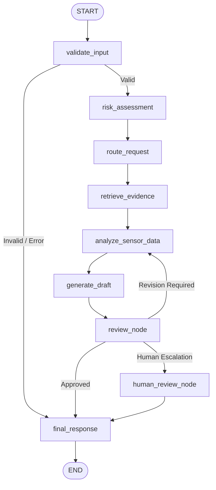

# Agent Workflow & StateGraph Design

**ManufacturingAgent: LangGraph Workflow Specification**

---

## 1. LangGraph StateGraph Architecture

The agent workflow is structured as a directed cyclic graph with strict safety review checkpoints and human escalation mechanisms.



---

## 2. Typed State Schema (`AgentState`)

```python
class AgentState(TypedDict):
    request_id: str               # Unique UUID / timestamp identifier
    machine_id: str               # Target equipment identifier (e.g. M-101)
    sensor_data: Dict[str, Any]   # Real-time telemetry (temp, vib, pres, speed, hum)
    user_query: str               # Diagnostic inquiry or operator question
    risk_level: str               # Evaluated tier: "NORMAL", "EDGE", "HIGH"
    risk_reason: str              # Engineering rationale for assigned tier
    tool_required: bool           # Flag indicating if additional tools were invoked
    selected_tools: List[str]     # List of tools selected (e.g. retrieval, history, calc)
    retrieved_documents: List[Dict[str, Any]] # Raw retrieved chunks
    evidence: List[Dict[str, Any]]# Formatted evidence with source & relevance score
    analysis: str                 # Engineering telemetry analysis text
    draft_response: str           # Evidence-grounded draft advisory
    review_status: str            # "approved", "revision_required", "human_review"
    review_reason: str            # Quality and grounding audit rationale
    human_decision: Optional[str] # "approve", "reject", "request_revision"
    human_notes: Optional[str]    # Engineer feedback notes
    final_response: str           # Delivered advisory with audit banners
    provider: str                 # Active LLM provider
    error: Optional[str]          # Validation or runtime error message
    latency: Optional[float]      # End-to-end execution duration in seconds
    iteration_count: Optional[int]# Revision loop counter (max 2)
```

---

## 3. Node Responsibilities & Logic

| Node Name | Input State Keys | Output State Keys | Responsibility |
| :--- | :--- | :--- | :--- |
| `validate_input` | `machine_id`, `user_query`, `sensor_data` | `machine_id`, `sensor_data`, `error`, `risk_level` | Verifies payload presence, looks up missing telemetry, catches validation failures. |
| `risk_assessment` | `sensor_data`, `machine_id` | `risk_level`, `risk_score`, `risk_reason`, `selected_tools` | Evaluates ISO 10816 vibration and thermal thresholds; selects required tools. |
| `route_request` | `risk_level` | None (State passthrough) | Transitional audit logging. |
| `retrieve_evidence`| `user_query`, `sensor_data`, `risk_level` | `retrieved_documents`, `evidence` | Queries RAG vector store for relevant SOPs, manuals, and tolerance tables. |
| `analyze_sensor_data`| `sensor_data`, `evidence`, `risk_level` | `analysis` | Correlates telemetry numbers with cited engineering standards. |
| `generate_draft` | `analysis`, `evidence`, `sensor_data` | `draft_response` | Constructs formatted advisory separating Grounded Evidence from Model Recommendations. |
| `review_node` | `draft_response`, `evidence`, `sensor_data` | `review_status`, `review_reason` | Audits grounding, numerical consistency, and safety boundary adherence. |
| `human_review_node`| `draft_response`, `risk_level`, `request_id` | `final_response`, `review_status` | Registers escalation ticket in review queue; appends `HUMAN REVIEW REQUIRED` banner. |
| `final_response` | `draft_response`, `final_response`, `error` | `final_response` | Assembles final delivery payload. |
