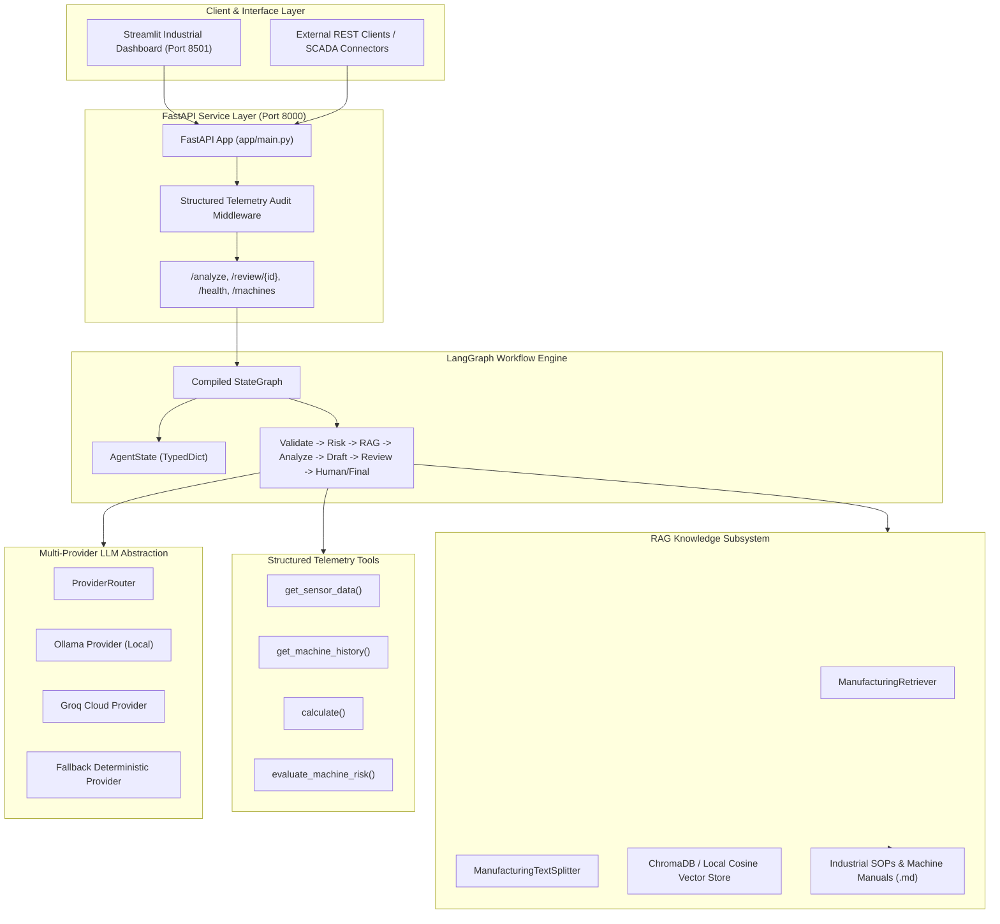

# System Architecture & Technical Specifications

**ManufacturingAgent: Evidence-Grounded Manufacturing Monitoring and Decision-Support Agent with Risk Routing and Human Review**

---

## 1. High-Level Architectural Overview

ManufacturingAgent is designed as a bounded, evidence-grounded industrial decision-support system. It decouples high-level reasoning and RAG evidence synthesis from physical shop-floor actuation.

---

## 2. Component Subsystems

### 2.1 API & Middleware Layer (`backend/app/main.py`)
- **FastAPI Framework**: High-throughput asynchronous routing with OpenAPI / Swagger documentation (`/docs`).
- **Telemetry Audit Middleware**: Automatically logs `request_id`, `provider`, `risk_level`, `latency_ms`, and `review_status` while strictly filtering API keys and authorization headers.
- **CORS Support**: Permissive cross-origin policy for seamless local development and Streamlit frontend integration.

### 2.2 LangGraph Orchestration Layer (`backend/app/agent/`)
- **Typed State (`AgentState`)**: Encapsulates telemetry payload, risk evaluations, tool history, retrieved documentation evidence, draft advisories, and review decisions.
- **Dynamic Conditional Routing**: Directs workflow to appropriate nodes based on risk calibration (`NORMAL`, `EDGE`, `HIGH`) and review audit status (`approved`, `revision_required`, `human_review`).

### 2.3 RAG Knowledge Subsystem (`backend/app/rag/`)
- **Document Ingestion**: Loads engineering manuals and standard operating procedures.
- **Context-Preserving Splitter**: Chunks documents by markdown header boundaries, preserving section titles and document origins in metadata.
- **Dual Vector Store Architecture**: Integrates ChromaDB with an automatic local in-memory cosine store fallback to ensure zero-dependency execution.

### 2.4 Multi-Provider LLM Router (`backend/app/providers/`)
- **Abstract Provider Interface**: Standardized `generate(prompt, system_prompt)` signature across all providers.
- **Supported Providers**:
  - `ollama`: Integrates with local Ollama daemons (Llama 3, Mistral, Gemma).
  - `groq`: Ultra-fast inference via Groq Cloud API.
  - `fallback`: Offline deterministic diagnostic generator for zero-network environments and continuous integration tests.
