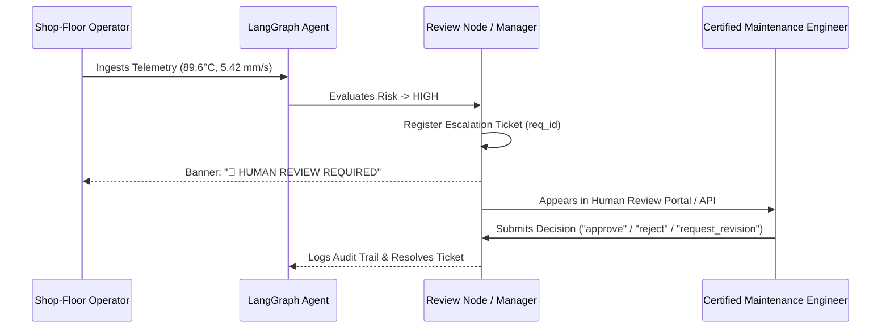

# Human-in-the-Loop Review Architecture

**ManufacturingAgent: Human Review & Escalation Protocol**

---

## 1. Rationale for Human-in-the-Loop (HITL)

Autonomous AI systems must never execute direct, unsupervised interventions in industrial manufacturing environments. Over-reliance on model outputs in high-stakes operational settings risks severe machinery damage, tooling destruction, or operator safety hazards.

The ManufacturingAgent implements a deterministic **Human-in-the-Loop Review Gate** for:
1. All `HIGH` risk operational breaches (severe vibration, extreme spindle heat, hydraulic pressure loss).
2. Sensor hardware faults (e.g. open-circuit thermocouples, transducer dropouts).
3. Ambiguous `EDGE` conditions where retrieved RAG evidence is inconclusive.

---

## 2. Human Review Workflow



---

## 3. Human Review REST API Endpoints

### 3.1 `GET /review/pending`
Retrieves all tickets currently awaiting human engineer review.

### 3.2 `GET /review/{request_id}`
Retrieves full ticket metadata, telemetry snapshot, retrieved evidence count, draft response, and resolution status.

### 3.3 `POST /review/{request_id}`
Submits a human engineer decision.
- **Request Body**:
  ```json
  {
    "decision": "approve",
    "notes": "Verified bearing damage. Dispatched mechanical overhaul team.",
    "reviewer_id": "CHIEF_MAINT_ENG_01"
  }
  ```
- **Allowed Decisions**:
  - `approve`: Engineer confirms analysis and approves maintenance intervention.
  - `reject`: Engineer determines anomaly is an unflagged calibration dry-run or false positive.
  - `request_revision`: Engineer requests re-analysis with modified operational assumptions.
