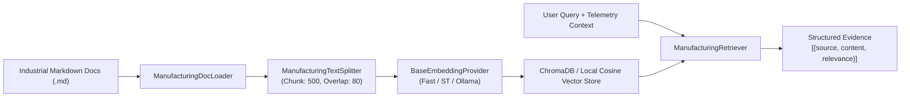

# RAG Knowledge Base Architecture & Document Grounding

**ManufacturingAgent: Retrieval-Augmented Generation Specification**

---

## 1. Grounded Knowledge Base Corpus

The RAG knowledge base comprises 6 realistic, high-fidelity industrial engineering documents located in `data/documents/`:

1. **`machine_manual.md`**: Technical specifications for CNC-Mill-V4 and Lathe-Pro-X machines, continuous vs intermittent RPM ratings, nominal and critical temperature/vibration/pressure envelopes.
2. **`maintenance_sop.md`**: Tier 1 (daily), Tier 2 (weekly), and Tier 3 (monthly overhaul) maintenance protocols and inspection checklists.
3. **`temperature_guidelines.md`**: Spindle thermal zones (Zone 1: 20-68°C Normal, Zone 2: 68.1-82°C Edge Warning, Zone 3: >82°C Critical High Risk).
4. **`vibration_guidelines.md`**: ISO 10816-3 severity standards for rigid foundation machines (Class A: 0-1.8 mm/s Normal, Class B: 1.81-3.8 mm/s Edge, Class C/D: >3.8 mm/s Critical).
5. **`pressure_guidelines.md`**: Hydraulic and pneumatic pressure thresholds (4.5-6.5 bar Nominal, <3.8 bar Critical Low, >7.8 bar Critical Over-pressure).
6. **`safety_procedures.md`**: AI decision-support safety boundaries, non-actuation protocols, and escalation rules.

---

## 2. Ingestion & Retrieval Pipeline

---

## 3. Chunking Strategy & Metadata Preservation

Unlike naive character splitting, `ManufacturingTextSplitter` uses markdown header boundaries (`#`, `##`, `###`) to preserve logical section hierarchy.

Each chunk retains:
- `source`: Filename (e.g. `vibration_guidelines.md`)
- `title`: Document Title (e.g. `Vibration Guidelines`)
- `section_title`: Specific Section (e.g. `Vibration Severity Classification`)
- `chunk_id`: Sequential chunk index
- `chunk_length`: Character length

---

## 4. Citation and Format Separation

To eliminate hallucinations and prevent model over-confidence, all generated draft responses enforce a strict two-section separation:
- **Section 2: Grounded Technical Evidence**: Lists the exact document source, section name, relevance score, and quoted tolerance threshold.
- **Section 3: Model Diagnostic Analysis**: Presents the model's analytical hypothesis clearly labeled as advisory interpretation.
